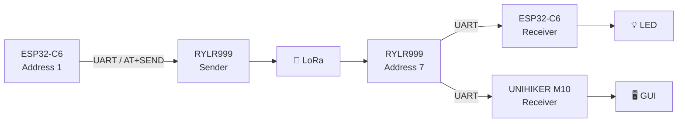
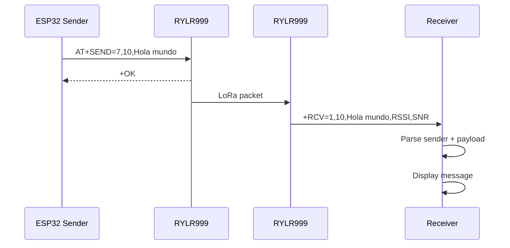

# 📡 LoRa RYLR999

### Sending and receiving LoRa messages with REYAX RYLR999, ESP32-C6 and UNIHIKER M10

[](https://reyax.com/product/LoRa/RYLR999)
[](https://wiki.dfrobot.com/dfr1075/)
[](https://www.unihiker.com/wiki/)
[](https://www.python.org/)
[](LICENSE)

**Roni Bandini — Buenos Aires, Argentina — November 2025**

**LoRa RYLR999** is a small collection of examples for experimenting with long-range communication using **[REYAX RYLR999](https://reyax.com/product/LoRa/RYLR999)** LoRa + BLE modules.

The repository contains three examples:

1. 📤 **ESP32-C6 sender** — sends `Hola mundo` every five seconds.
2. 📥 **ESP32-C6 receiver** — receives LoRa packets and can turn its onboard LED on or off from remote messages.
3. 🖥️ **UNIHIKER M10 receiver** — receives packets and displays timestamp, sender address and message on its screen.

The examples communicate with the RYLR999 through its LoRa UART using simple **AT commands**.

---

## ✨ Features

* 📡 REYAX RYLR999 LoRa communication
* 🛰️ Addressed point-to-point messages
* 🧩 Simple UART + AT-command interface
* ♾️ ESP32-C6 Arduino examples
* 🐍 Python receiver for UNIHIKER M10
* 🖥️ Incoming messages displayed on UNIHIKER
* 🕐 Timestamped messages
* 🏷️ Sender-address extraction
* 💡 Remote LED `on` / `off` example
* 📶 RSSI and SNR available in received packets
* 🔵 / 🟢 NeoPixel status feedback on UNIHIKER
* 📡 RYLR999 BLE functionality available for further expansion

---

# 🏗️ Architecture



The examples use:

```text
Sender address:   1
Receiver address: 7
Network ID:       18
```

---

# 📡 REYAX RYLR999

The **RYLR999** combines two independent wireless systems:

```text
868 / 915 MHz LoRa
        +
2.4 GHz Bluetooth Low Energy
```

Each is exposed through a separate UART.

Official specifications include:

| Feature                |        Specification |
| ---------------------- | -------------------: |
| LoRa frequency range   |      **820–960 MHz** |
| Typical LoRa bands     |        868 / 915 MHz |
| Maximum LoRa RF output |           **30 dBm** |
| LoRa sensitivity       | down to **-133 dBm** |
| BLE RF output          |     up to **20 dBm** |
| LoRa maximum payload   |        **240 bytes** |
| UART default           |       **115200 8N1** |
| Supply                 |      **4.75–5.25 V** |
| Digital I/O            |            **3.3 V** |
| Dimensions             |   **25 × 22 × 3 mm** |

Official resources:

👉 **[RYLR999 Product Page](https://reyax.com/product/LoRa/RYLR999)**

👉 **[RYLR999 Datasheet](https://reyax.com/upload/products_download/download_file/RYLR999_EN.pdf)**

👉 **[RYLR999 AT Command Manual](https://reyax.com/upload/products_download/download_file/RYLR999_AT_Command_EN.pdf)**

---

# 🧩 LoRa AT Commands

The module does not require an Arduino LoRa library.

Communication is handled through text commands terminated with:

```text
\r\n
```

Typical setup:

```text
AT+ADDRESS=1
AT+NETWORKID=18
```

The receiver uses:

```text
AT+ADDRESS=7
AT+NETWORKID=18
```

Modules must share compatible:

* `NETWORKID`
* RF frequency
* spreading factor
* bandwidth
* coding rate
* preamble settings

REYAX recommends configuring the address and network before transmitting.

---

# 📤 Sending Data

RYLR999 uses:

```text
AT+SEND=<Address>,<Length>,<Data>
```

Example:

```text
AT+SEND=7,10,Hola mundo
```

The sender sketch builds the command dynamically:

```cpp
String mensaje = "Hola mundo";
int largo = mensaje.length();

String comando =
    "AT+SEND=7," +
    String(largo) +
    "," +
    mensaje;

sendATCommand(comando);
```

Main firmware:

👉 **[`sender.ino`](https://github.com/ronibandini/LORARYLR999/blob/main/sender.ino)**

The message is transmitted every:

```cpp
5000
```

milliseconds.

After each transmission the FireBeetle onboard LED on:

```cpp
int led = 15;
```

blinks for **200 ms**.

---

# 📥 Received Packet Format

RYLR999 automatically reports incoming messages as:

```text
+RCV=<Address>,<Length>,<Data>,<RSSI>,<SNR>
```

For example:

```text
+RCV=1,10,Hola mundo,-91,12
```

where:

| Field        | Meaning        |
| ------------ | -------------- |
| `1`          | Sender address |
| `10`         | Payload length |
| `Hola mundo` | Data           |
| `-91`        | RSSI           |
| `12`         | SNR            |

The official AT-command manual specifies this same response format.

---

# ♾️ ESP32-C6 Sender

The sender uses a **[DFRobot FireBeetle 2 ESP32-C6](https://wiki.dfrobot.com/dfr1075/)**.

UART:

```cpp
HardwareSerial LoRaSerial(2);

LoRaSerial.begin(
    57600,
    SERIAL_8N1,
    4,
    5
);
```

Meaning:

```text
ESP32 GPIO4 → RX
ESP32 GPIO5 → TX
```

Connect crosswise:

| RYLR999 LoRa UART | FireBeetle  |
| ----------------- | ----------- |
| RX                | GPIO 5 / TX |
| TX                | GPIO 4 / RX |
| GND               | GND         |

The sketch configures:

```cpp
sendATCommand("AT+ADDRESS=1");
sendATCommand("AT+NETWORKID=18");
```

and then sends to:

```text
Address 7
```

every five seconds.

---

# 📥 ESP32-C6 Receiver

Receiver firmware:

👉 **[`receiver.ino`](https://github.com/ronibandini/LORARYLR999/blob/main/receiver.ino)**

It uses the same UART pins:

```cpp
LoRaSerial.begin(
    57600,
    SERIAL_8N1,
    4,
    5
);
```

but configures the module as:

```cpp
AT+ADDRESS=7
AT+NETWORKID=18
```

The program waits for asynchronous:

```text
+RCV=
```

messages.

---

# 🔍 Packet Parsing

The ESP32 receiver extracts the data field from:

```text
+RCV=<sender>,<length>,<data>,<RSSI>,<SNR>
```

using:

```cpp
if (msg.startsWith("+RCV=")) {

    int dataStart =
        msg.indexOf(',') + 1;

    dataStart =
        msg.indexOf(',', dataStart) + 1;

    int dataEnd =
        msg.indexOf(',', dataStart);

    if (dataEnd > 0) {
        data =
            msg.substring(
                dataStart,
                dataEnd
            );
    }
}
```

So:

```text
+RCV=1,2,on,-87,10
```

becomes:

```text
on
```

---

# 💡 Remote LED Example

The receiver also demonstrates a simple remote-control application.

If the payload contains:

```text
on
```

the FireBeetle onboard LED is enabled:

```cpp
if (data.indexOf("on") >= 0) {
    digitalWrite(led, HIGH);
}
```

For:

```text
off
```

it is disabled:

```cpp
else if (
    data.indexOf("off") >= 0
) {
    digitalWrite(led, LOW);
}
```

To test this functionality, change the sender payload from:

```cpp
String mensaje = "Hola mundo";
```

to:

```cpp
String mensaje = "on";
```

or:

```cpp
String mensaje = "off";
```

---

# 🐍 UNIHIKER Receiver

The third example replaces the receiving ESP32 with a **[UNIHIKER M10](https://www.unihiker.com/wiki/)**.

Python application:

👉 **[`lorareceiver.py`](https://github.com/ronibandini/LORARYLR999/blob/main/lorareceiver.py)**

Initialization:

```python
Board("UNIHIKER").begin()

gui = GUI()

uart = UART(bus_num=0)

uart.init(
    baud_rate=115200,
    bits=8,
    parity=0,
    stop=1
)
```

Unlike the ESP32 sketches, this version communicates at the RYLR999's factory-default:

```text
115200 baud
```

---

# 🔌 UNIHIKER UART

UNIHIKER hardware UART 1 uses:

```text
P0 → RX
P3 → TX
```

Therefore:

| RYLR999 LoRa UART | UNIHIKER |
| ----------------- | -------- |
| TX                | P0 / RX  |
| RX                | P3 / TX  |
| GND               | GND      |

Official reference:

👉 **[UNIHIKER UART / PinPong Documentation](https://www.unihiker.com/wiki/LanguageReference/PinPong_Library/Communication/1_Serial_Port_UART_/)**

### Power

The current **RYLR999 datasheet specifies 4.75–5.25 V for VDD**, while its UART digital I/O operates at **3.3 V logic levels**.

Use the current REYAX datasheet as the reference for module power.

---

# 🖥️ Graphical Receiver

At startup, the UNIHIKER displays:

```text
LORA Receiver
Roni Bandini
```

and configures:

```python
send_at("AT+ADDRESS=7")
send_at("AT+NETWORKID=18")
```

When a packet arrives, Python separates its fields:

```python
parts = msg.split(',')

sender = parts[0].split('=')[1]
data = parts[2]
```

A timestamp is generated with:

```python
timestamp = datetime.now().strftime(
    "%H:%M:%S"
)
```

and displayed as:

```text
14:32:18 (1) Hola mundo
```

This makes the UNIHIKER version useful as a simple LoRa message monitor.

---

# 🟢 UNIHIKER Visual Feedback

The application uses three external NeoPixels:

```python
np1 = NeoPixel(
    Pin(Pin.P13),
    3
)
```

At startup they briefly turn blue:

```python
np1.range_color(
    0,
    2,
    0x0000FF
)
```

When a valid `+RCV` message arrives they turn green:

```python
np1.range_color(
    0,
    2,
    0x00FF00
)
```

and switch off again after two seconds.

---

# 🔄 Communication Flow



---

# ⚙️ Baud-Rate Configuration

This repository contains two UART configurations:

### ESP32 examples

```text
57600 baud
```

### UNIHIKER example

```text
115200 baud
```

The **RYLR999 factory default is 115200 baud**.

To use the ESP32 sketches exactly as provided, configure each module once:

```text
AT+IPR=57600
```

The setting is stored in module flash.

Alternatively, change:

```cpp
LoRaSerial.begin(
    57600,
    SERIAL_8N1,
    4,
    5
);
```

to:

```cpp
LoRaSerial.begin(
    115200,
    SERIAL_8N1,
    4,
    5
);
```

to use factory-default modules.

---

# 📻 RF Configuration

The example sketches explicitly configure only:

```text
ADDRESS
NETWORKID
```

RYLR999 also supports:

```text
AT+BAND
AT+PARAMETER
AT+CRFOP
AT+CPIN
```

Factory defaults include:

```text
Band:             915 MHz
Spreading Factor: 9
Bandwidth:        125 kHz
Coding Rate:      1
Preamble:         12
Network ID:       18
RF power:         30 dBm
UART:             115200
```

Both communicating modules need compatible RF parameters.

Example:

```text
AT+BAND=915000000
AT+PARAMETER=9,7,1,12
```

The RYLR999 also supports **868 MHz configurations** through `AT+BAND`.

---

# 🔐 Optional Network Password

The module supports:

```text
AT+CPIN=<password>
```

with an eight-character hexadecimal password.

For example:

```text
AT+CPIN=EEDCAA90
```

Modules using the same password can recognize each other's data.

This feature is not used in the repository examples.

---

# 📡 BLE + LoRa

RYLR999 contains a second independent UART for Bluetooth Low Energy.

REYAX documents a hardware configuration in which the BLE and LoRa UARTs are interconnected, allowing a phone or BLE device to pass commands/data into the LoRa link.

Conceptually:


Official application note:

👉 **[RYLR999 BLE-to-LoRa Converter Application](https://reyax.com/upload/products_download/download_file/RYLR999_BLE_to_LoRa_convertor_application.pdf)**

---

# 🛠️ Hardware

For the examples in this repository:

| Component                                                          |    Quantity |
| ------------------------------------------------------------------ | ----------: |
| [REYAX RYLR999](https://reyax.com/product/LoRa/RYLR999)            |           2 |
| [DFRobot FireBeetle 2 ESP32-C6](https://wiki.dfrobot.com/dfr1075/) |         1–2 |
| [UNIHIKER M10](https://www.unihiker.com/wiki/)                     |    Optional |
| LoRa antennas                                                      |           2 |
| Jumper wires                                                       |     Several |
| USB cables / suitable power                                        | As required |

You can test:

```text
ESP32 → ESP32
```

or:

```text
ESP32 → UNIHIKER
```

with the same RYLR999 radio modules.

---

# 🚀 ESP32 Setup

## 1. Install Arduino IDE

👉 **[Arduino IDE](https://www.arduino.cc/en/software)**

## 2. Configure ESP32 Support

Follow the FireBeetle guide:

👉 **[FireBeetle 2 ESP32-C6 Getting Started](https://wiki.dfrobot.com/dfr1075/docs/20703)**

## 3. Clone the Repository

```bash
git clone \
https://github.com/ronibandini/LORARYLR999.git

cd LORARYLR999
```

Repository:

👉 **[github.com/ronibandini/LORARYLR999](https://github.com/ronibandini/LORARYLR999)**

## 4. Upload Sender

Open:

👉 **[`sender.ino`](https://github.com/ronibandini/LORARYLR999/blob/main/sender.ino)**

## 5. Upload Receiver

Open:

👉 **[`receiver.ino`](https://github.com/ronibandini/LORARYLR999/blob/main/receiver.ino)**

Both use Serial Monitor at:

```text
115200 baud
```

---

# 🚀 UNIHIKER Setup

Copy:

👉 **[`lorareceiver.py`](https://github.com/ronibandini/LORARYLR999/blob/main/lorareceiver.py)**

to the UNIHIKER and run:

```bash
python3 lorareceiver.py
```

The program uses the standard:

* `unihiker`
* `pinpong`

libraries supplied with the UNIHIKER environment.

Official documentation:

👉 **[UNIHIKER M10 Documentation](https://www.unihiker.com/wiki/)**

👉 **[PinPong UART API](https://www.unihiker.com/wiki/LanguageReference/PinPong_Library/Communication/1_Serial_Port_UART_/)**

---

# 📁 Repository Structure

```text
LORARYLR999/
│
├── sender.ino
├── receiver.ino
├── lorareceiver.py
├── README.md
└── LICENSE
```

* 📤 **[`sender.ino`](https://github.com/ronibandini/LORARYLR999/blob/main/sender.ino)** — ESP32 LoRa transmitter
* 📥 **[`receiver.ino`](https://github.com/ronibandini/LORARYLR999/blob/main/receiver.ino)** — ESP32 LoRa receiver + LED example
* 🖥️ **[`lorareceiver.py`](https://github.com/ronibandini/LORARYLR999/blob/main/lorareceiver.py)** — UNIHIKER graphical receiver
* ⚖️ **[`LICENSE`](https://github.com/ronibandini/LORARYLR999/blob/main/LICENSE)** — MIT License

---

# 🌐 External References

## 📡 REYAX RYLR999

Official product information:

👉 **[REYAX RYLR999](https://reyax.com/product/LoRa/RYLR999)**

Datasheet:

👉 **[RYLR999 Datasheet](https://reyax.com/upload/products_download/download_file/RYLR999_EN.pdf)**

AT commands:

👉 **[RYLR999 AT Command Guide](https://reyax.com/upload/products_download/download_file/RYLR999_AT_Command_EN.pdf)**

BLE-to-LoRa:

👉 **[RYLR999 BLE-to-LoRa Application Note](https://reyax.com/upload/products_download/download_file/RYLR999_BLE_to_LoRa_convertor_application.pdf)**

---

## 🔥 DFRobot FireBeetle 2 ESP32-C6

👉 **[FireBeetle 2 ESP32-C6 Wiki](https://wiki.dfrobot.com/dfr1075/)**

👉 **[FireBeetle 2 ESP32-C6 Product Page](https://www.dfrobot.com/product-2771.html)**

---

## 🖥️ UNIHIKER

👉 **[UNIHIKER M10 Documentation](https://www.unihiker.com/wiki/)**

👉 **[UNIHIKER UART Documentation](https://www.unihiker.com/wiki/LanguageReference/PinPong_Library/Communication/1_Serial_Port_UART_/)**

---

# 🔗 Related GitHub Projects

### 📍 BLE Indoor Location

Indoor pet-location prototype using FireBeetle ESP32 and BLE beacons.

👉 **[github.com/ronibandini/bleIndoorLocation](https://github.com/ronibandini/bleIndoorLocation)**

### 📡 mmWave Alarm

Human-presence detector using ESP32 and mmWave radar with remote notifications.

👉 **[github.com/ronibandini/mmWaveAlarm](https://github.com/ronibandini/mmWaveAlarm)**

### ❤️ Heart & Respiration Monitor

UNIHIKER + ESP32-C6 project for displaying mmWave heart and respiration data.

👉 **[github.com/ronibandini/heartRespirationMonitor](https://github.com/ronibandini/heartRespirationMonitor)**

### 🧩 n8n Terminal

Physical UNIHIKER interface for n8n workflows.

👉 **[github.com/ronibandini/n8nTerminal](https://github.com/ronibandini/n8nTerminal)**

---

# 📕 Contracultura Maker

**Contracultura Maker** is a book by Roni Bandini about maker culture, experimental electronics, AI, physical computing and technological autonomy.

📂 **[Contracultura Maker — GitHub repository](https://github.com/ronibandini/ContraculturaMaker)**

📕 **[Download Contracultura Maker PDF](https://github.com/ronibandini/ContraculturaMaker/raw/refs/heads/main/ContraculturaMaker2.pdf)**

---

# 📬 Contact

**Roni Bandini**
Maker · AI Developer · Writer
Buenos Aires, Argentina

* 🐙 [GitHub — @ronibandini](https://github.com/ronibandini)
* 🌐 [Medium — @ronibandini](https://bandini.medium.com/)
* 𝕏 [X / Twitter — @RoniBandini](https://x.com/RoniBandini)
* 📸 [Instagram — @ronibandini](https://www.instagram.com/ronibandini/)
* ▶️ [YouTube — @RoniBandini](https://www.youtube.com/@RoniBandini)
* 💼 [LinkedIn — Roni Bandini](https://www.linkedin.com/in/ronibandini/)

---

Built with 📡 + LoRa + ESP32-C6 + UNIHIKER.
